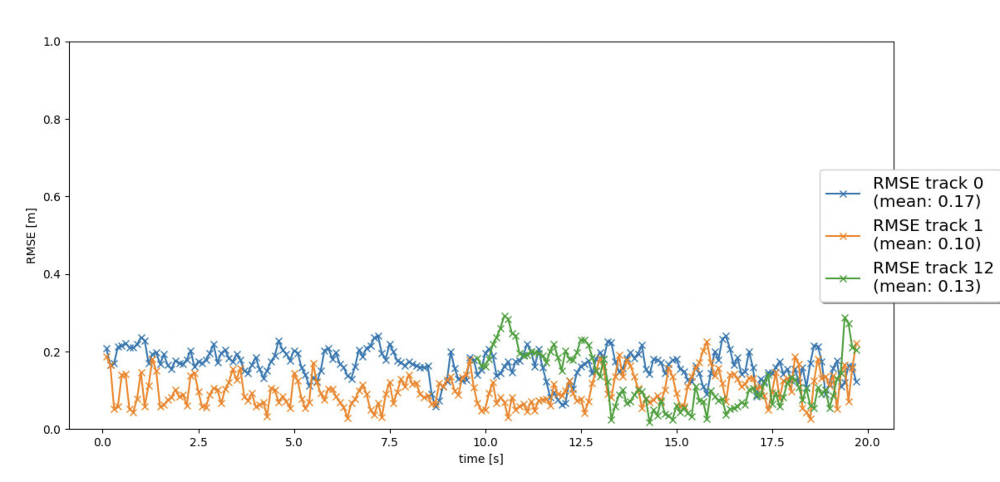

# Writeup: Project: Sensor Fusion and Object Detection
The final project consists of four main steps:

- Step 1: Implement an extended Kalman filter.
- Step 2: Implement track management including track state and track score, track initialization and deletion.
- Step 3: Implement single nearest neighbour data association and gating.
- Step 4: Apply sensor fusion by implementing the nonlinear camera measurement model and a sensor visibility check.

Since the final project is based on the mid-term project, same code files are used as in the mid-term.

### Step 1: Implemented Extended Kalman Filter Algorithm (EKF) for estimation of other vehicles in 3D space.
To implement an Extended Kalman Filter (EFK), the 6 dimensional system states [x, y, z, vx, vy, vz], process noise Q for constant velocity motion model are designed. To update the current state calculation, h(x) and the Jacobian H are calculated. In the first step, the EKF is applied to simple single-target scenario with lidar only. This is shown in the below figure.

To evaluate the tracking performance, the mean of root mean squared error (RMSE) is calculated. As depicted, the mean RMSE results are smaller than the given reference value 0.35. 

For tracking a single vehicle, I achieved a RMSE score of 0.32

### Step 2: Track Management
In the second step, the track management is implemented to initialize and delete tracks, set a track state and a track score. First, the track is initialized with unassigned lidar calculation and decrease the track score for unassigned tracks. Then tracks are deleted if the score is too low or P is too big. The below figure shows the single track without track losses in between.

Manage initialization of new detected vehicles, updating current tracks, and deleting old ones. Each track has a corresponding score value, which depicts the confidence score of the detection. Each track also has a state as either 'initialised', 'tentative', or 'confirmed'

### Step 3: Association of tracks and sensor measurements
In the data association, the closest neighbor association matches measurements to tracks and decides which track to update with which measurement by using the Mahalanobis Distance (MHD). The MHD measures the distance between a point and a distribution. The MHD is used to exclude unlikely track pairs by comparing threshold which is created based on the chi-squared distribution. The following figures show the data association results and corresponding rmse results.

### Step 4: Fuse measurements from camera along with Lidar
To complete the sensor fusion system, the camera measurements including covariance matrix R are implemented. Therby, the function of ``Sensor`` class called ``in_fov()`` is implemented to check if the input state vector of an object can be seen by this sensor. Here, we have to transform from vehicle to sensor coordinates. Furthermore, a nonlinear camera measurement model h(x) is implemented.

First, I set ``configs_det.use_labels_as_objects`` to False to see how the tracking performance looks with model-based detection. As shown in the gif and figure with rmse results, only few vehicles are tracked correctly. In gif, you can see that some ground truth is not even taken into account. 

### 2. Do you see any benefits in camera-lidar fusion compared to lidar-only tracking (in theory and in your concrete results)? 
In theory, the tracking performance can be stabilized by fusion of multiple sensor. In camera-lidar fusion, camera provides visual information which may show advantages in classification of objects by including color, contrast and brightness. On the other hand, lidar can provide rich spatial information. Combining the two sensor strengths, better tracking performance can be achieved.

In my concrete results, as shown in the step 4, a lot of efforts must be spent to improve the detection performances such that better tracking performance can be achieved. Even adding ground truth information in detection phase, significant increase of tracking performance can be expected. 

### 3. Which challenges will a sensor fusion system face in real-life scenarios? Did you see any of these challenges in the project?
- Since camera is a passive environmental sensor, the detection accuracy might be influenced by lighting conditions. This will lead to decrease of tracking performance.
- When many objects come too close, the occlusion can occur that often leads to wrong tracking of occluded objects.

### 4. Can you think of ways to improve your tracking results in the future?
- Advanced design of process noise covariance might be a conceivable solution to achieve better tracking performance.
- Instead of using `fpn_resnet`, different pretrained neural networks can be used to compare the tracking performances. 

